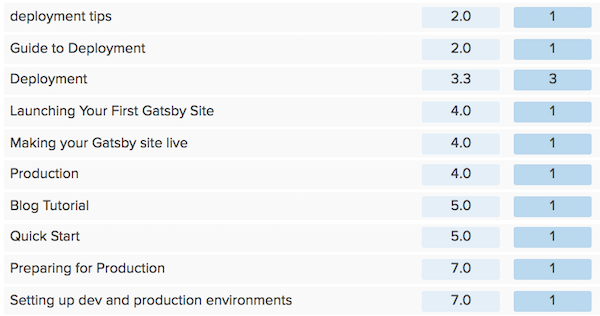
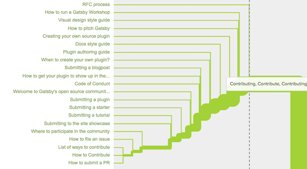

## What is a card sort?

Recently, 36 Gatsby users completed an open card sort to help make our docs here on gatsbyjs.org easier to use. Without any outside input or help, they each sorted 90 cards into categories that made sense to them and then named those categories.

### Raw & beautified data

I ran this card sort through [OptimalSort](https://www.optimalworkshop.com/), a software that moderates the card sort and presents the data in usable forms. If you’re curious to see the full results, you can [view the data](https://www.optimalworkshop.com/optimalsort/x87kpp82/5x34psa3-0/shared-results/fa8b66knb66qyhwh5l8j38bd273vkkm7), including raw data as well as things like a similarity matrix and a [dendrogram](https://support.optimalworkshop.com/en/articles/2626862-interpret-the-optimalsort-dendrograms-for-open-and-hybrid-card-sorts).

## How did participants categorize the docs?

People sorted the docs into the following categories:

- Get Started / Welcome to Gatsby / Intro
- Development environment
- Releases & Migration
- Core Concepts / About Gatsby
- Advanced Guides
- API Reference
- Tutorials / Examples
- Contributing

These categories weren’t too surprising (I included multiple names when the some category names were equally popular). However, upon further digging into the data, I discovered some unexpected results that further refine how we might categorize the docs, write new docs, and change how we think and talk about Gatsby.

## PWA

No one seems to know what to do with the doc titled “Building apps with Gatsby”. In the similarity matrix data visualization, 41% of people associated it with the “Authentication tutorial” doc and 41% also associated it with the “Progressive web app” doc. A 41% isn’t *very* strong. Essentially, this means participants didn’t think it “fit” very snugly alongside any other docs.

This could mean several things:

1. We don’t have very many docs about how Gatsby can be used to build dynamic apps
2. People don’t think of Gatsby as a tool they’d use to build apps with
3. The title of the doc is too broad or too vague

Without interviewing each participant I can’t be sure, but I’m inclined to think a combination of all three factors means people don’t know where to put that doc in the navigation. This might mean we need clarity in how we present what Gatsby *is* in all our informational material and marketing and that we build more docs about Gatsby being more than a static site generator.

### Deployment

There was a lot of disagreement about where docs about deployment should go. For example, card sort participants placed the “Build and deploy a live site” doc in 28 unique categories. Here’s a sample of the categories:

The three most common categories it was placed under are “Getting Started”, “Tutorials,” and “Deployment.” Other categories include “Examples,” “Guides,” and “Production.” Here are the deployment docs that need to find a place to call home:

- Build and deploy a site
- Preparing site for deployment
- Deploying a site live online

One solution that occurred to me is to bring Deployment & Hosting to top level navigation as their own category, since there was so little agreement on where to put them.

> ***NOTE:*** If you look at the data, the number of unique categorizations isn’t always a useful number, because Optimal Sort considers “getting started” and “get started” to be different categories even though a human eye can see they are essentially the same. However, in the case of these deployment docs, there were 28 categories and many of them are *truly unique*.

### Core Concepts vs. Advanced Guides

There was quite a bit of overlap in the docs people assigned to these two categories. This is probably because the two categories have a close relationship with each other; they work in harmony to help Gatsby users build at an advanced level. For example, if you read about how Gatsby works with GraphQL in “Core Concepts,” there is a high chance you’ll want to start playing with GraphQL queries and find examples of these in “Advanced Guides.” I’m not entirely sure how to reflect this close relationship in the docs; the most straightforward way is probably for each doc in “Core Concepts” to have a list of relevant links in "Advanced Guides," and vice versa.

Here’s a sampling of docs that people associate with both categories:

- Search engine optimization (SEO)
- Authentication
- E-commerce

List of other lonely docs that didn’t find a solid home through the card sort:

- The “RFC Process” doc didn’t find a snug fit. Two people didn’t know what it meant, and 44% of people put it under Contributing, but that’s not a majority. Seems like many people don’t know where to put it. I’m wondering if the title is too vague.
- There was little agreement on where the “Html.js” doc goes. There was a 47% association with Babel and a 47% association with using layouts to build reusable site sections.
- “React components” highest association was a 47% association with “basic structure of a Gatsby site” and all its associated pages. This slightly low association score probably results from the fact that the .org site doesn’t teach that much React at all, and there aren’t many docs on React specifically.

## Dendrogram adventures

These screenshots that show a portion of the dendrogram show that the clearest category was "Contributing", clear because the category name and the contents of the category are consistent:

Gatsby users are in agreement on what that category ought to be called and what docs it should contain :)

## Next steps

### Usability testing

The next step is to conduct usability testing on a new design of the .org site. I’ve already conducted 8 usability tests with several more coming (5-7 produces reliable data in conventional UX research practices) and I’m seeing more ways to improve what we place in these categories as well as many ways I can improve my usability testing :).

Many thanks to all those participants who have been enthusiastic and willing to give feedback, including Korey Boone, Shannon Smith, Peter Wiebe, Abhishek Vishwakarma, Ria Carmin, and Hugo Marques, Bogdan Lazar, Cameron Steele, and Simon Koelewijn. There are quite a few more people meeting with me in the upcoming week.

These are the docs categories I’ve used for usability testing so far:

- Get Started
- Core Concepts
- Releases
- API Reference
- Recipes
- Tutorials
- Contributing

Here are a few realizations from usability testing already:

- sometimes people don’t see the search bar on the .org site
- when searching for something in the docs or to solve an error, many people do a google search before using docs navigation or the .org search bar
- the category name “Recipes” was unclear to most people, although once they see the contents of the category, most people tend to like it
- the usability testing validated one of the card sort results, which is that some docs kind of fit in three categories: "Core Concepts" and "Recipes" and "Tutorials". These categories are all closely related and will need to link to each other often

### What’s next

Stay tuned for the results of the usability test and the new sidebar menu of the .org site, which will likely get released together :D

And please read and comment on the [Doc Redesign RFC](https://github.com/gatsbyjs/rfcs/pull/5) if you have more ideas on how we can redesign the docs!