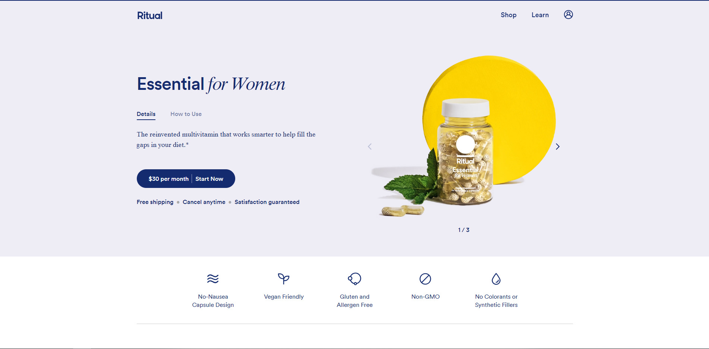

[Ritual](https://ritual.com/) is a health brand led by the belief that women should know exactly what’s in their vitamins. Ritual’s vitamins work smarter to fill the gaps in women’s diets with high quality nutrients. They’re on a mission to inspire women to feel their best, every day. Ritual’s clean, modern stack website, leads customers speedily through an educational purchase experience to learn more about the products, the ingredients, and overall benefits they can find by investing in their vitamin habits every day.

We reached out to their Director of Engineering, Daniel Archer, to share ”Why Gatsby?” for their recent website rebuild. Here’s some of our conversation:

## The Gatsby answer: Better code, SEO, page load times, and integration

Ritual chose a rebuild with Gatsby due to the restrictions they were running into with liquid templates and UI-based content changes. While static and fast, the issues were making it more difficult to bring code up to their modern engineering standards. They also needed to enable other teams to quickly and easily change copy, imagery and new concepts. Both of these led them to look for a new solution - Gatsby.

“We were looking for opportunities to combine a powerful CMS with React and Styled Components for maximum composability, while still maintaining a static-site for optimized SEO and page load times,” shared Daniel.

In addition, they had some specific business and impact goals they were trying to achieve with the new site and top on that list was improving their development velocity.

<Pullquote citation="Daniel Archer"> We felt that investing in the combination of React, GraphQL, and a headless CMS as early as possible would allow us to streamline our delivery pipeline and iterate faster. </Pullquote>

## Gatsby and React: Shorter builds, rapid changes

Although they considered alternatives like Django, Ghost and Jekyll, they realized these other solutions would require significant new tooling, a longer timeline and a longer ramp-up period.

<Pullquote citation="Daniel Archer"> We first chose Gatsby because of the appeal with one popular Gatsby solution of using Contentful and Netlify. We felt like it was a compelling ideal to empower our content and creative teams to make rapid changes to our site, and to enable our engineering team to develop in simple, reusable React components that work with a GraphQL interface. </Pullquote>

## Results: Scaling through Gatsby v1 and Gatsby v2

The initial site re-launched on Gatsby v1 while bringing over some of the legacy pages into the overall codebase. Since then, the six-member Ritual team has rebuilt legacy pages using their new engineering practices, iterated over several other site pages and subsequently upgraded to Gatsby v2, which was a “fairly seamless” and painless process.

<Pullquote citation="Daniel Archer"> I think the most important facet of the Gatsby experience is its Node environment, enabling data to not only inform the content of our site, but how it’s structured and the pages within. It’s allowed us to scale out many pages very quickly, and to easily relate among data nodes. </Pullquote>

And like so many others, Daniel confirmed that the Gatsby “documentation and community are *huge* reasons for anybody to pay attention to Gatsby. There’s so many great plugins and open source contributions as well, making it such a vibrant community of talented engineers.”

Is this your kind of community? Join us!