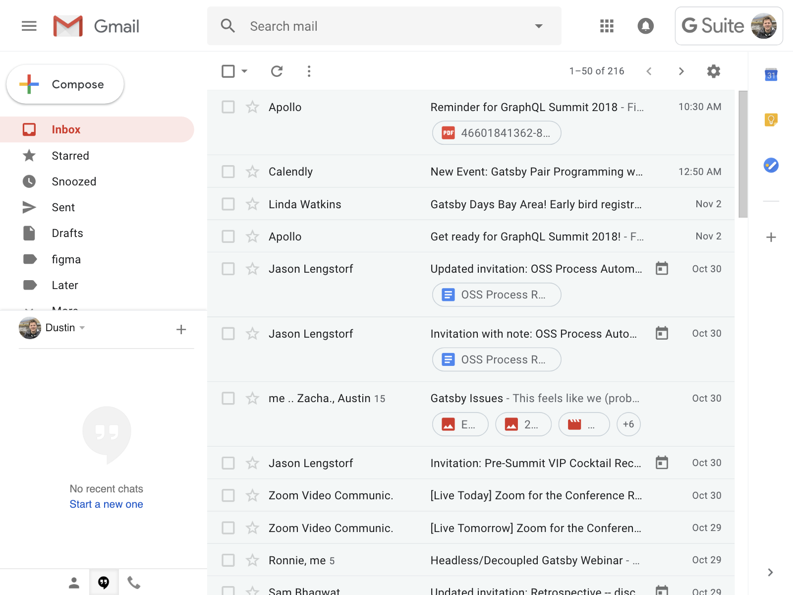
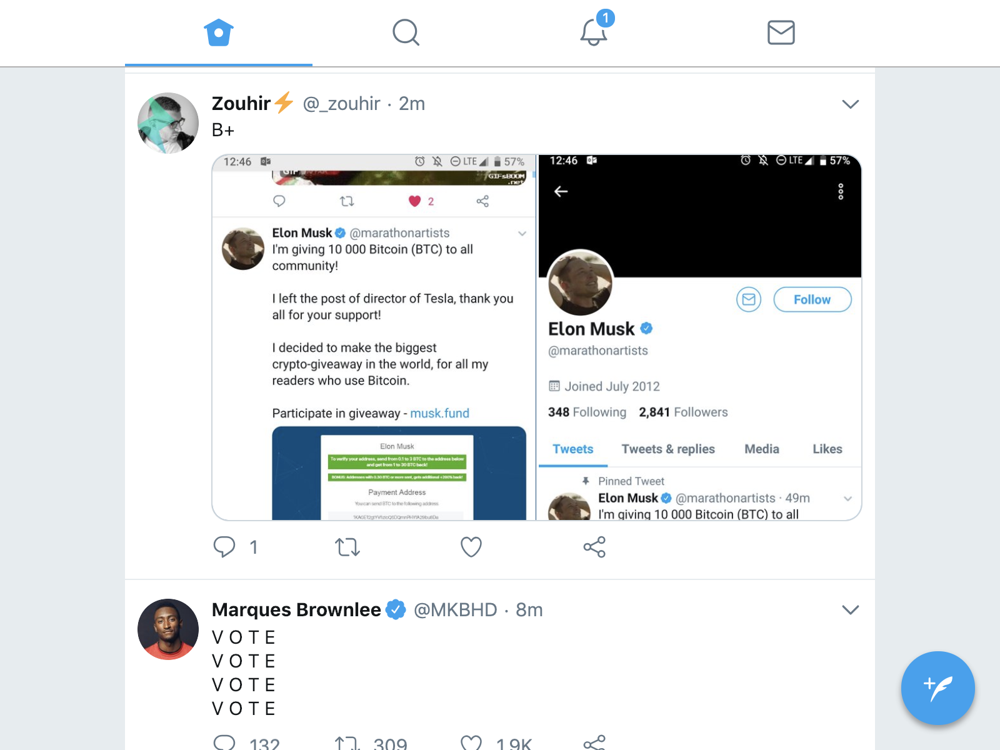
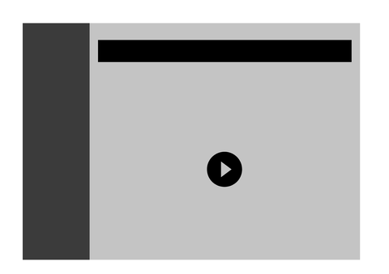
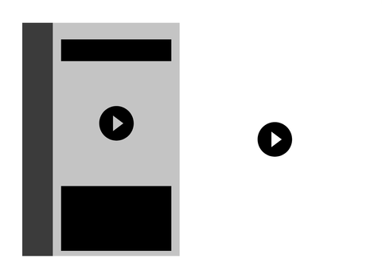
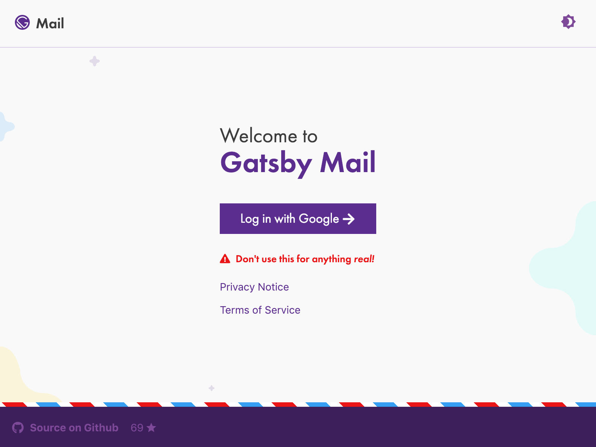
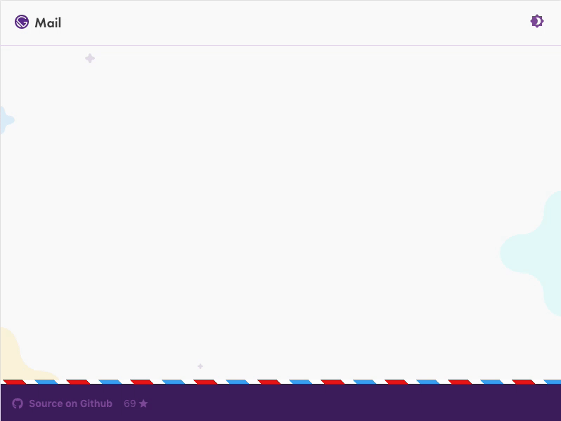

Gatsby is great for static sites. You probably know this! It’s equally great for web applications. You may not know this. Gatsby is great for building web experiences that leverage the benefits of both so called static sites and web applications -- simultaneously. You don't have to sacrifice the advantages of one approach to reap the benefits of the other.

<!-- ☝️ Shout out to Amberley for the assist with this intro 🔥 -->

In this post, we'll go into some of the use cases that make for a compelling web application, such as dynamic data fetching, user authentication, and detail *why* Gatsby is an excellent choice for building web applications.

We'll take a look at a classic web application -- Gmail -- which we rebuilt in Gatsby as a demo of how Gatsby can create engaging, modern web applications.

To begin, what even *is* an application, anyways?

> Note:
> 
> If you haven't already, consider checking out ["Beyond Static: Building Dynamic Apps with Gatsby"](https://www.gatsbyjs.com/build-web-apps-webinar) where many ideas in this blog post are presented in a video/webinar format.

## What is an application?

I've previously attempted the [surprisingly difficult task](/blog/2018-10-15-beyond-static-intro/#what-is-an-app) of defining what constitutes a traditional web application. In an effort to not re-hash all the work there, I think there are several, key features that indicate a more app-like experience:

- dynamic data fetching
- user authentication and authenticated client-only routes
- client-side JS interactions

Of course, a web app isn't some checklist wherein *each* of these functionalities are required to indicate an app-like experience. Rather, I think it's easier to *see* an example of a web application -- one that encapsulates several of these functionalities -- to form a mental model of the type of web app that Gatsby can build.

For me there are two key examples that are at the forefront of my mental model of what constitutes a modern web application... Gmail and Twitter.

### Gmail

[](https://gmail.com)

Gmail served as an early proof of concept that proved out two, key functional wins:

1. Client-side JavaScript can power an app-like experience, and
2. a JavaScript application (running in your browser) can compare favorably to traditional, native applications for desktop and mobile

The impact of these wins can’t be understated. Gmail *proved* that a native, app-like experience is not only possible for end users, but that it can even be preferable and more convenient than the native experience. We'll revisit this trusty Gmail web application example in due time.

Next up, is Twitter, for slightly different reasons.

### Twitter (Progressive Web Application)

[](https://m.twitter.com)

Twitter is another key example of my mental model for what an application *is* (and can be!) because it both:

- illustrates some of the power of the modern web experience, and
- uses some great performance optimizations and smart engineering practices to serve up an engaging, fast, app-like experience

In particular, I find the following functionalities of Twitter as key markers for a separate kind of application:

- Aggressive data caching and fast page navigation with service workers
- Integration of the [PRPL pattern](https://developers.google.com/web/fundamentals/performance/prpl-pattern/) (**P**ush, **R**ender, **P**re-cache, and **L**azy load)
- The illustration of the [App Shell](https://developers.google.com/web/fundamentals/architecture/app-shell) pattern to speed up repeat visits and show a maximally visually complete page

These *modern* concepts, coupled together, are key for the value of Twitter's approach to an app-like experience. Twitter engineers were able to strip down the core Twitter experience and deliver a blazing-fast modern web application utilizing some great engineering techniques and patterns, that many users like even more than the full experience. To learn more about these techniques, check out this great [case study](https://developers.google.com/web/showcase/2017/twitter) from Google and Addy Osmani.

These two web applications will serve as key foundational pieces to keep in mind as the discussion shifts to Gatsby for web applications.

## Gatsby is for Applications


What if I told you... that building a Gatsby website enables all of these traditional web-app like functionalities because a Gatsby "static site" is an application?

Every Gatsby application isn't merely static. It's *as much* static HTML rendered up-front, as possible. Client-side JavaScript (via React!) takes over as the engine for dynamic application functionality. A quick overview of Gatsby's general build process is effective to illustrate the concept.

1. Inject pages with data (from [GraphQL](/docs/querying-with-graphql/) or even [without using GraphQL](/docs/using-gatsby-without-graphql/))
2. Use the [ReactDOMServer.renderToString](https://reactjs.org/docs/react-dom-server.html#rendertostring) API to invoke server-side APIs to render React components to *HTML* files
3. Inject a runtime and helpers (like a router!) to enable app functionality 
   - Gatsby *produces* a [create-react-app](https://facebook.github.io/create-react-app/) like experience once this runtime takes over

To illustrate the concept, let's start with a classic example... we need to fetch some data at *run-time* rather than build-time.

```jsx:title=src/pages/messages.js import React from "react"

import Layout from "../components/layout"

class Messages extends React.Component { constructor(props) { super(props)

      this.state = {
        messages: [],
      }
    }
    
    // note: this is a simplified example without error handling, authentication, etc.
    async componentDidMount() {
      const messages = await fetch(`/api/some-url-to-get-messages`).then(
        response => response.json()
      )
    
      this.setState({
        messages,
      })
    }
    
    render() {
      const { messages } = this.state
      return (
        <Layout>
          {messages.length === 0 ? (
            <p>Loading messages&hellip;</p>
          ) : (
            <ul>
              {messages.map(message => (
                <li key={message.id}>{message.text}</li>
              ))}
            </ul>
          )}
        </Layout>
      )
    }
    

}

export default Messages ```

All we've done here is implement the [`componentDidMount`](https://reactjs.org/docs/react-component.html#componentdidmount) lifecycle method, which will fire off a request to some REST API to retrieve some data (messages!) from a remote API. At *runtime* our application is now fetching data, dynamically. This illustrates the effectiveness of the Gatsby + React *runtime* and how a Gatsby application is essentially a hydrated create-react-app like experience. [React lifecycle methods](https://reactjs.org/docs/state-and-lifecycle.html) are fully supported to implement whatever dynamic interaction is required, like data fetching in this example!

Consider the following animation, which mimics the end user experience. In effect, we've statically generated non-dynamic pieces (e.g. header, sidebar, etc.) and we then request additional data, on demand!



However--this is a fairly contrived, perhaps not completely real-world example. What if that REST API [requires authentication](/tutorial/authentication-tutorial/)? What if we want [client-only routes](/docs/client-only-routes-and-user-authentication), e.g. deep linking to a specific message? You better believe it's possible! GraphQL at build time and run time? Yup!

The central idea I want to clarify is that typically app-like features are not only *possible* with Gatsby, but intuitive and easy to implement due to the dynamic runtime enabled in every Gatsby application. It's *just* React.

Gatsby is for building dynamic, web applications, just as it is for building static sites. At this point, this has become clear. Gatsby can be used for many of the traditional cases for web applications, including authentication, client-only routes, dynamic data fetching, and more.

However, what hasn't been made clear is *why* you'd reach for Gatsby as opposed to other solutions.

## *Why* Gatsby for Apps?

### Built-in Performance Optimizations

If we revisit some of the benefits that Gatsby provides, minimally:

- Static rendering of React components and co-located data to static HTML
- Optimizing data, images, etc. for blazing-fast performance
- Internalizing performance patterns and best practices like [PRPL](https://developers.google.com/web/fundamentals/performance/prpl-pattern/), route-based code splitting, etc.

Each of these are worthy of far more detail, but suffice to say these are *great* functionalities that you want not only in your *static* site, but also in your application.

These performance optimizations aren't opt-in; they're enabled, by default. As new performance techniques and optimizations gain popularity, we can internalize these just as we have for these others optimizations. These optimizations can then be made available to your end users merely by upgrading your version of Gatsby, in much the same way tooling improvements are available by upgrading [create-react-app](https://facebook.github.io/create-react-app/).

### Plugins and the Gatsby Ecosystem

One of the key benefits of Gatsby is its highly modular architecture. Need a plugin for [sourcing data from Wordpress](/packages/gatsby-source-wordpress/)? Sure, seems reasonable. Need to [transform yaml data](/packages/gatsby-transformer-yaml/) into a usable, JavaScript object? Yeah, why not! Want to [stitch in a remote GraphQL API](/packages/gatsby-source-graphql/) and inject the data at *build* time? Oh, you're fancy! Want to load optimized, responsive, blur-in images? Yep.

Let's take a look at that image functionality provided by one of our components, `gatsby-image`, in slightly more detail.

#### `gatsby-image`

Certainly one of my favorite components that Gatsby provides and maintains is `gatsby-image`. This component gives excellent image rendering capabilities, along with image optimizations enabled by plugins like [`gatsby-plugin-sharp`](/packages/gatsby-plugin-sharp/). These two techniques, along with the GraphQL API made available to any Gatsby application, vastly simplifies the developer experience of serving optimized images, providing a number of features, including:

- Resizing large images to an optimized size for your design 
  - aka banish the practice of 5Mb above-the-fold hero images to the shadow realm
- Generate multiple, mobile-friendly images using `srcset` to serve *just* what your user's device needs
- Lazy load images with a blur-up technique--even using [traced SVGs](https://using-gatsby-image.gatsbyjs.org/traced-svg/)

`gatsby-image` is incredible. If you haven't yet integrated its capabilities into your application, I'd highly recommend taking a look! Check out our recently redesigned [Using Gatsby Image](https://using-gatsby-image.gatsbyjs.org/) example to learn more and see some live examples. Use `gatsby-image`, your users will thank you.

The power of these components and plugins is immense. In a similar way that reusable components have been incredibly valuable and successful for the growth of the React ecosystem, so to are plugins and ecosystem valuable for Gatsby applications. Why waste cycles reinventing these plugins and components when you can re-use and leverage the power of our open-source ecosystem? Using these plugins and components means more time to spend on building out your Gatsby application. Check out [our vast plugin library](/plugins) if you haven't already!

Next: let's compare and contrast the end user experience of fetching authenticated data between Gatsby and a server-rendered application.

### The App Shell

In merely adding the [`gatsby-plugin-offline`](/packages/gatsby-plugin-offline/) plugin, we enable a fully-featured, progressive web application that works offline and creates an app shell by registering a service worker. An app shell is essentially separate components of your application (e.g. header, footer, sidebar, etc.) that are instantly available from a service worker while dynamic content is fetched in the background. This creates a great end-user experience, as the application is able to visually populate instantly as data loads into place in the background.

If we consider this approach, the technique looks like the following:

1. Render as much content, as possible, up front (e.g. the app shell)
2. Make async data requests to load disparate pieces, e.g. load page content from an API, particularly an API with authentication

Let’s compare this approach with the server-rendered approach. Consider an authenticated API call for this example. This API call is used to populate page data before it's sent (as HTML) to the end user. We're forced to defer loading for the entire page and the bottleneck of the API response, rather than serving the app shell as dynamic data loads in the background.

Consider the following animation to clarify this example. On the left, an application using a service worker and an app shell, e.g. a Gatsby application. On the right, a server-rendered application that waits until the API call has resolved to serve the *entire* page all at once.



The benefits of this approach are clear. Loading an application shell gives end users the impression that the page is loading more quickly, even if in comparing the two approaches, both effectively load *all* the data after the same amount of time. This gives your users the best of both worlds... the appearance and feeling of being blazing fast and *actually* being blazing fast with the optimizations you get with Gatsby out of the box.

To unify all these concepts, I've assembled a demo application revisiting our old friend Gmail. This demo illustrates that rich web applications are not only *possible* in Gatsby, but that Gatsby is a great choice to build these types of applications.

## Introducing... Gatsby Mail! (For demo purposes only!)

[](https://gatsby-mail.netlify.com)

[Gatsby Mail](https://gatsby-mail.netlify.com) encapsulates some of the concepts and themes I've been hitting upon, particularly:

1. Gmail, Twitter, et al, are key exemplars of rich, web app experiences
2. Gatsby provides components, plugins, etc. for delivering great experiences; use them!
3. Gatsby is an excellent choice for building web applications

Additionally, Gatsby Mail shows some specific web application functionality, such as:

- Static rendering coupled with fetching dynamic data with the client runtime
- Authentication and client-only routes
- Non-authenticated routes, e.g. a landing page (using the [React Context](https://reactjs.org/docs/context.html) API)
- GraphQL at build time and *run time* utilizing a remote GraphQL API and [apollo-boost](https://github.com/apollographql/apollo-client/tree/master/packages/apollo-boost), and
- loading an app shell with `gatsby-plugin-offline` (check out the "Fast 3G" example below!)

and even a light/dark theme, because why not! You can see all of these concepts unify to form this great end-user experience in the below example with a simulated fast 3G connection. The app shell (header, footer, etc.) loads into place *instantly* as the dynamic content is fetched (from the remote GraphQL API!) in the background.



Check out the [GitHub repo](https://github.com/dschau/gatsby-mail) to learn more about how it was built and adopt some of the techniques as you build your next great Gatsby web **application**.

We can't wait to see what you build.